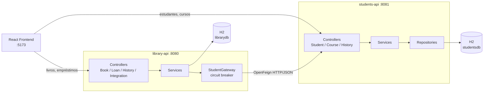
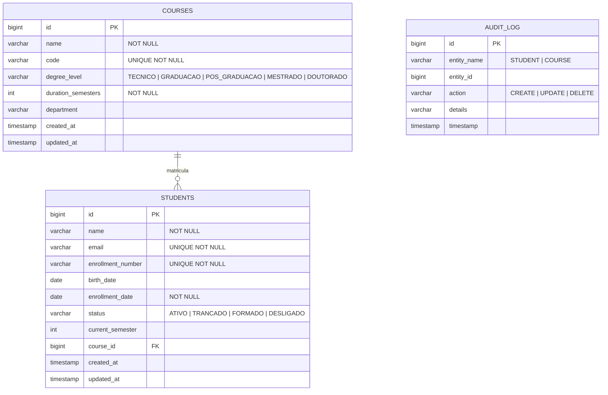

# Students API — Microsserviço de Estudantes e Cursos

Microsserviço criado no **TP3** da disciplina *Engenharia de Softwares Escaláveis*. Ele contém o domínio de **estudantes** que antes vivia dentro do monólito [`library-api`](../library-api), agora extraído para um serviço independente, com **banco próprio** e **ciclo de vida próprio**.

> Além do cadastro de estudante, o serviço ganhou um segundo agregado — **Curso** — para que a separação faça sentido de verdade: o microsserviço passa a ser o dono de um pedaço coeso do negócio (a vida acadêmica do aluno), e não apenas de uma tabela.

## Papel na arquitetura



**Regra de ouro da separação:** este serviço é o **dono único** dos dados de estudante. A `library-api` não tem mais a entidade `Student` nem a tabela `students` — ela guarda apenas o `student_id` em cada empréstimo e consulta os dados aqui.

## Tecnologias

| Tecnologia | Uso |
|---|---|
| Java 21 / Spring Boot 4.1.0 | Base do microsserviço |
| Spring Web MVC | API REST |
| Spring Data JPA + Hibernate | Persistência e repositórios |
| Bean Validation (Jakarta) | Validação dos payloads de entrada |
| H2 Database | Banco `studentsdb`, separado do `librarydb` |
| Lombok | Redução de boilerplate |
| JUnit 5 + AssertJ + Mockito | Testes automatizados |

## Modelo de dados

Banco **`studentsdb`**, totalmente independente do banco da biblioteca.



O `status` do estudante não é decorativo: é ele que a `library-api` consulta para decidir se o aluno pode pegar um livro emprestado. Só quem está **`ATIVO`** consegue.

### Mapeamento JPA

- `@Entity` + `@Table`, `@Id` + `@GeneratedValue(IDENTITY)` e `@Column` com `nullable`/`unique`/`length` — mesmas convenções do TP2.
- `Student` → `Course` é `@ManyToOne` + `@JoinColumn(name = "course_id")`; o lado inverso (`Course.students`) usa `@OneToMany(mappedBy = "course")` com `@JsonIgnore` para não gerar recursão na serialização.
- `@Enumerated(EnumType.STRING)` grava `StudentStatus`, `DegreeLevel` e `AuditAction` como texto legível.
- `@EntityListeners(AuditingEntityListener.class)` + `@CreatedDate`/`@LastModifiedDate` preenchem `createdAt`/`updatedAt`. O `@EnableJpaAuditing` fica em [`JpaAuditingConfig`](src/main/java/com/infnet/studentsapi/config/JpaAuditingConfig.java), e não na classe da aplicação, para que os testes de fatia web (`@WebMvcTest`) não tentem inicializar o metamodelo JPA.

## Repositórios Spring Data — exemplos de uso

```java
// Query methods derivados
Optional<Student> findByEnrollmentNumber(String enrollmentNumber);
List<Student> findByStatus(StudentStatus status);
List<Student> findByCourseId(Long courseId);
boolean existsByCourseId(Long courseId);
List<Course> findAllByOrderByNameAsc();

// JPQL agregado — quantos alunos ativos cada curso tem, em uma única consulta
@Query("""
        SELECT s.course.id, COUNT(s)
        FROM Student s
        WHERE s.course IS NOT NULL AND s.status = com.infnet.studentsapi.model.StudentStatus.ATIVO
        GROUP BY s.course.id
        """)
List<Object[]> countActiveStudentsByCourse();
```

Uso na camada de serviço:

```java
// CourseService.findSummary() — evita um SELECT COUNT por curso (N+1)
Map<Long, Long> activeByCourse = new HashMap<>();
for (var row : studentRepository.countActiveStudentsByCourse()) {
    activeByCourse.put((Long) row[0], (Long) row[1]);
}

// CourseService.delete() — o curso só sai se ninguém estiver matriculado nele
if (studentRepository.existsByCourseId(id)) {
    throw new BusinessException("Nao e possivel remover o curso ...");
}
```

## Endpoints da API

### Estudantes

| Método | Endpoint | Descrição |
|---|---|---|
| GET | `/api/students` | Lista todos os estudantes (com o curso aninhado) |
| GET | `/api/students/{id}` | Busca por id — `404` se não existir |
| GET | `/api/students/search/name/{name}` | Busca por nome (parcial, sem caixa) |
| GET | `/api/students/enrollment/{number}` | Busca por matrícula |
| GET | `/api/students/status/{status}` | Filtra por situação (`ATIVO`, `TRANCADO`, `FORMADO`, `DESLIGADO`) |
| GET | `/api/students/course/{courseId}` | Alunos de um curso |
| POST | `/api/students` | Cadastra — `201`, `400` (validação) ou `409` (email/matrícula duplicados) |
| PUT | `/api/students/{id}` | Atualiza — `200`, `404`, `400` ou `409` |
| DELETE | `/api/students/{id}` | Remove — `204` ou `404` |

### Cursos

| Método | Endpoint | Descrição |
|---|---|---|
| GET | `/api/courses` | Lista os cursos em ordem alfabética |
| GET | `/api/courses/summary` | Cursos **com a contagem de alunos ativos** |
| GET | `/api/courses/{id}` | Busca por id |
| GET | `/api/courses/code/{code}` | Busca por código (ex.: `ESW`) |
| GET | `/api/courses/level/{degreeLevel}` | Filtra por nível |
| POST | `/api/courses` | Cadastra — `201`, `400` ou `409` (código duplicado) |
| PUT | `/api/courses/{id}` | Atualiza |
| DELETE | `/api/courses/{id}` | Remove — `409` se o curso ainda tiver alunos |

### Histórico de mudanças

| Método | Endpoint | Descrição |
|---|---|---|
| GET | `/api/history` | Todo o histórico do microsserviço, mais recente primeiro |
| GET | `/api/history/{entidade}` | Histórico de uma entidade (`STUDENT`, `COURSE`) |
| GET | `/api/history/{entidade}/{id}` | Histórico de um registro específico |

Cada microsserviço mantém o **seu próprio** `audit_log`, no seu próprio banco — a auditoria não é compartilhada entre serviços.

### Contrato de erro

Erros de negócio e de validação respondem em JSON com o campo `message`, que é o formato que o front-end já sabe ler:

```json
{ "status": 409, "error": "Conflict", "message": "Ja existe um estudante com o email 'maria@infnet.edu.br'" }
```

## Exemplo de fluxo (curl)

```bash
# 1. Cadastrar um curso
curl -X POST http://localhost:8081/api/courses -H "Content-Type: application/json" \
  -d '{"name":"Engenharia de Software","code":"ESW","degreeLevel":"GRADUACAO","durationSemesters":8,"department":"Tecnologia"}'

# 2. Cadastrar um estudante vinculado ao curso
curl -X POST http://localhost:8081/api/students -H "Content-Type: application/json" \
  -d '{"name":"Maria Silva","email":"maria@infnet.edu.br","enrollmentNumber":"2026001","birthDate":"2001-03-12","status":"ATIVO","currentSemester":5,"courseId":1}'

# 3. Cursos com a contagem de alunos ativos
curl http://localhost:8081/api/courses/summary

# 4. Trancar a matrícula (a library-api passa a recusar empréstimos para ele)
curl -X PUT http://localhost:8081/api/students/1 -H "Content-Type: application/json" \
  -d '{"name":"Maria Silva","email":"maria@infnet.edu.br","enrollmentNumber":"2026001","status":"TRANCADO","currentSemester":5,"courseId":1}'

# 5. Consultar o histórico de mudanças do aluno
curl http://localhost:8081/api/history/STUDENT/1
```

## Banco de dados

H2 em memória (`jdbc:h2:mem:studentsdb`), configurado em [`application.properties`](src/main/resources/application.properties). Console web: `http://localhost:8081/h2-console` (usuário `sa`, senha em branco).

Como o banco é em memória, o [`DataSeeder`](src/main/java/com/infnet/studentsapi/config/DataSeeder.java) carrega 3 cursos e 4 alunos de exemplo no start — desativado no perfil `test`.

## Como executar

```bash
./mvnw spring-boot:run     # microsserviço em http://localhost:8081
```

O microsserviço é independente: ele sobe e funciona sozinho, sem a `library-api`. A dependência é de mão única (a biblioteca depende dele, não o contrário).

## Testes automatizados

```bash
./mvnw test
```

**33 testes**, cobrindo o microsserviço de ponta a ponta:

| Teste | Tipo | O que cobre |
|---|---|---|
| `StudentRepositoryTest` | `@DataJpaTest` | CRUD, relacionamento com `Course`, query methods, a JPQL agregada de alunos ativos por curso e a JPQL de alunos por semestre, restrições de unicidade |
| `CourseRepositoryTest` | `@DataJpaTest` | CRUD, busca por código/nível, ordenação e código único |
| `AuditLogRepositoryTest` | `@DataJpaTest` | Timestamp automático e as consultas do histórico |
| `StudentServiceIntegrationTest` | `@SpringBootTest` | Regras de negócio (email/matrícula duplicados, curso inexistente, defaults), histórico CREATE/UPDATE/DELETE com diff de campos, bloqueio de remoção de curso com alunos e o resumo com contagem de ativos |
| `StudentControllerTest` | `@WebMvcTest` | Os endpoints REST: serialização do curso aninhado, filtros, `201`/`204`/`404`, `400` de validação e `409` de regra de negócio |
| `StudentsApiApplicationTests` | `@SpringBootTest` | Carga do contexto |
